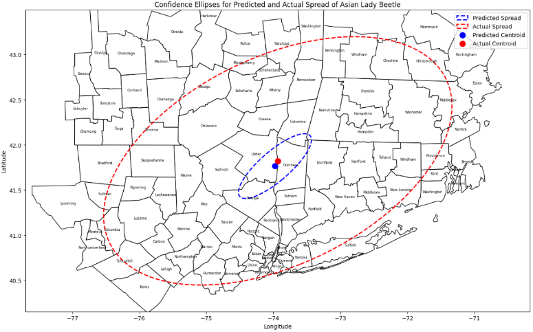
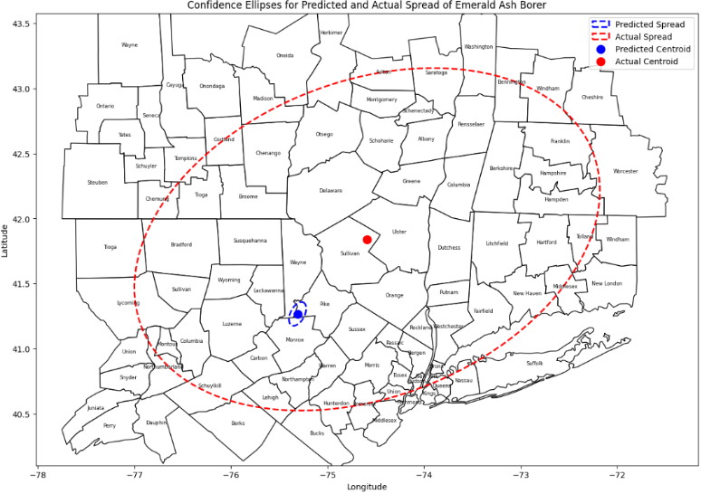

# Invasive Insect Classifier

BioCLIP CustomLabelsClassifier on a balanced invasive vs. native look-a-like species using iNaturalist data.

# Invasive Insect Spread Predictor

A hybrid CNN–LSTM model to forecast the geographic propagation of invasive insect species using iNaturalist data.

## 1. Conservation Motivation

Invasive insects cause an estimated \$30 Billion in annual U.S. damages and threaten ecosystem health by out-competing native species. Early identification and spread forecasting are critical to prioritize interventions.

---

## 2. Data Source & Processing

- **Data:** 171,545 images of target invasive species and 67,395 of native look-alikes from iNaturalist, filtered to the northeastern U.S.  
- **Features:**  
  - **Spatial:** latitude, longitude, one-hot region codes  
  - **Temporal:** year, month, day, normalized “time percentile”  
- **Splits:** 60 % train / 20 % validation / 20 % test

---

## 3. Model Architecture

  1. **CNN** encodes spatial grids of sightings  
  2. **LSTM** captures temporal patterns (seasonality)  
  3. **Dense** layers with dropout & L₂ regularization

---

## 4. Training & Evaluation

- **Loss:** Mean Squared Error  
- **Early Stopping:** on validation MSE (patience = 5 epochs)  
- **Metrics:**  
  - **Test losses** ranged from **0.97 to 1.83**
  - **Geographic mean error** spanned **7.34 to 87.51 km**
  - **95th-percentile latitude/longitude errors**: ~2–5 km  

---

## 5. Key Results

| Species                  | # Sightings | Test Loss | Test MAE | Mean Geo Error (km) |
|--------------------------|------------:|----------:|---------:|--------------------:|
| **Asian Lady Beetle**    |      41 803 |      1.12 |     0.89 |               12.4  |
| **Emerald Ash Borer**    |       1 272 |      1.83 |     1.05 |               87.5  |

*(Exact MAE and per-species errors available in the report.)*

---

## 6. Visualization

- **Confidence Ellipses:** Compare predicted vs. actual spread  
- **Centroid Error Maps:** Overlay forecast vs. ground truth

