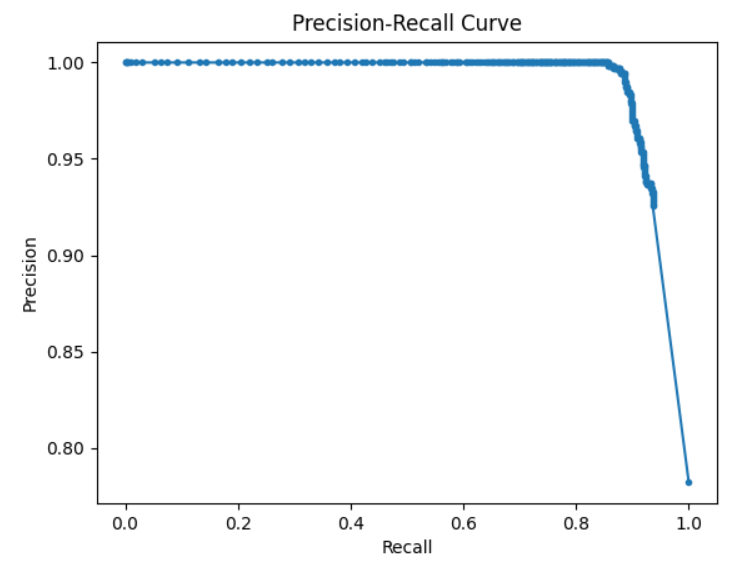

## 1. Transformer Parameter Derivation

**Goal:**  
Derive the total number of trainable weights in one encoder block of a multi‐headed self‐attention transformer given:
- embedding dimension $d_k$
- number of heads $h$

**Result:**  
Each encoder block combines
- **Multi-Head Attention:** $4d^2_k$ parameters  
- **Feed-Forward Network:** $8d^2_k$ parameters  

Multi-Head Attention + Feed-Forward Network = $4d^2_k + 8d^2_k = 12d^2_k$

---

## 2. Exploratory Data Analysis

**Goal:**  
Characterize the Karoo camera‐trap dataset before modeling.

**Key Findings:**  
- **Total images:** 1 000  
- **Empty (blank) images:** 218 
- **Unique species:** 13  
- **Top species by count:**  
  - oryx gazella: 219  
  - tragelaphus oryx: 89  
  - antidorcas marsupialis: 78  
- **Class imbalance & blank‐frame prevalence** were identified as primary challenges.  

---

## 3. Blank‐Frame Classification with MegaDetector

**Goal:**  
Automatically flag “blank” (no animals) vs. “filled” images using the maximum confidence from MegaDetector detections.

**Approach:**  
1. Run **MegaDetector v5** on each frame → list of bounding boxes with confidences.  
2. Classify an image as **“filled”** if the confidence threshold $\ge$ 0.5, otherwise **“blank.”**  
3. Generate a Precision–Recall curve and pick the decision rule (here the default 0.5 threshold produced strong results).

**Results:**  
- **Precision–Recall Curve:**  
    
- **Threshold used:** 0.50  
- **F1 Score:** 0.9245  
- **Confusion Matrix (blank vs. filled):**

$$
\begin{pmatrix}
217 & 1 \\
109 & 673 \\
\end{pmatrix}
$$
